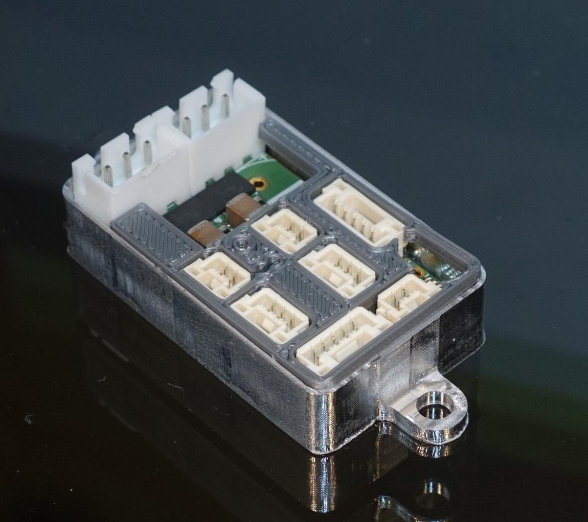

# µMotor: a motor controller for BLDC and DC motors up to 250W

µMotor (or micro-motor) is a motor controller PCB and software made to control any BLDC and DC motor up to 250W.

The micro-motor is supplied with power and CAN bus via a single connector and can control the motor independently.
In addition, a limit switch can be read out and the temperature of the motor can be monitored.

Communication is done via Can-Bus using CANopen protocol.

The software is written using the [modm.io](https://modm.io/) framework and [librobots2](https://github.com/roboterclubaachen/librobots2).

For more information read the following blog posts about the project (in German):
* [µMotor: Idee](http://www.roboterclub.rwth-aachen.de/blog/2018/micro-motor-motorcontroller.html)
* [µMotor: Inbetriebnahme und Debugging](http://www.roboterclub.rwth-aachen.de/blog/2018/micro-motor-debugging-inbetriebnahme.html)
* [µMotor 2 - Teil 1: Konzept](http://www.roboterclub.rwth-aachen.de/blog/2019/micro-motor-2-teil-1.html)
* [µMotor 2 - Teil 2: Strommessung](http://www.roboterclub.rwth-aachen.de/blog/2019/micro-motor-2-teil-2.html)
* [µMotor 2 - Teil 3: Microcontroller & Stromversorgung](http://www.roboterclub.rwth-aachen.de/blog/2019/micro-motor-2-teil-3.html)
* [µMotor 2 - Teil 4: Strom- und Spannungsmessung mit ADC](https://www.roboterclub.rwth-aachen.de/blog/2020/micro-motor-2-teil-4.html)

## Technical data
* 3 phases (BLDC and DC motors)
* Approx. 10A per phase (with precise current measurement)
* 24V nominal operating voltage
* Adjustable cycle-by-cycle current limiting (short circuit protection)
* CAN bus
    * CAN-FD supported
    * CANopen protocoll (partial implemented)
* AB(I) incremental encoder connector
* Hall sensor connector
* Temperature sensor (NTC) connector
* Limit switch (GPIO) connector
* LEDs for status and diagnosis
* Configurable ID (from STM32 hardware ID)
* Easy to solder and assemble

## Status

PCBs *micro-motor-v1 (rev1)* and *macro-motor* are not supported anymore.

The second version *micro-motor-v2* is basically functional, software improvements are in progress.

PCB _micro-motor-v2.1_ is similar to _v2_, but with added RC filters at encoder connector,
added 1 µF capacitor to the STM32 _VREFBUF_ output and changed DC/DC converter modules (caused by component shortage).

Software at HEAD is compatible with micro-motor-v2.\[0,1,2\], however the correct version needs to be selected in the project.xml to account for hardware differences with "Board.v2_1" being compatible with v2.0, and v2.1 and "Board.v2_2" being compatible with v2.2.

## Folder structure

#### `kicad/pcb_name/`
* KiCad files of the PCBs

#### `STM32CubeMX/`
* Pinout configuration of the STM32 microcontrollers done with [STs CubeMX software](https://www.st.com/en/development-tools/stm32cubemx.html)

#### `tests/`
* Test software. Useful during PCB assembly

#### `app/`
* Main Software

#### `src/`
* Common files used between main software and tests.

## License

Software is licensed under [GPLv3](LICENSE).
Hardware (PCB files, ...) is licensed under [CERN OHL v.1.2](LICENSE.hardware).
